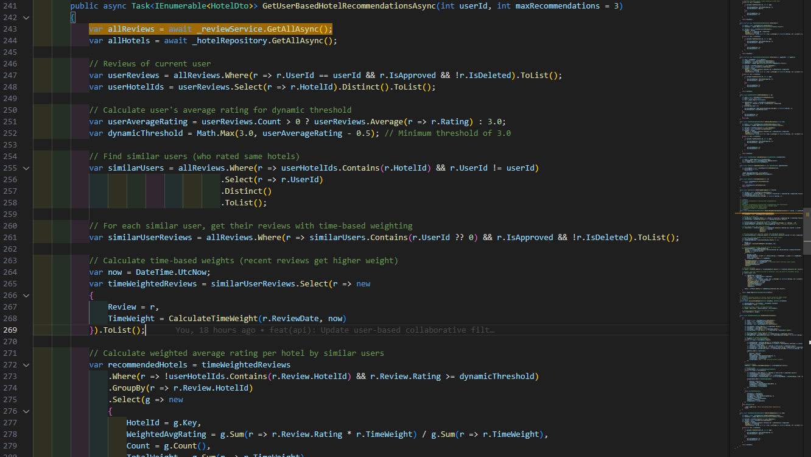
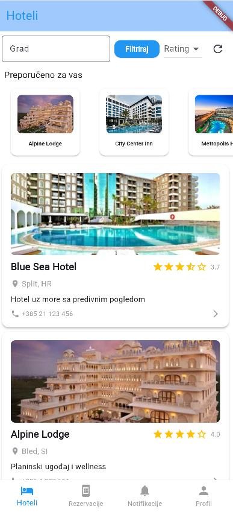
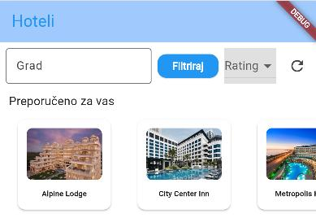

# Dokumentacija: Algoritam za preporuku hotela

## 1. Dohvat podataka

- Iz baze podataka dohvaćaju se svi hoteli i njihove recenzije.
- U obzir se uzimaju samo recenzije koje su odobrene i nisu obrisane.

## 2. Analiza trenutnog korisnika

- Identifikuju se svi hoteli koje je trenutni korisnik već ocijenio.
- Kreira se lista ID-jeva tih hotela, koja će kasnije služiti za filtriranje.

## 3. Izračun dinamičkog praga

- Dinamički prag određuje minimalnu vrijednost ocjene koja se uzima u obzir.
- Prag se prilagođava na osnovu prosječne ocjene trenutnog korisnika:
  - Ako korisnik prosječno ocjenjuje visoko (npr. 4.5) → prag se postavlja na 4.0.
  - Ako korisnik prosječno ocjenjuje nisko (npr. 2.5) → prag se postavlja na minimalnih 3.0.

## 4. Pronalaženje sličnih korisnika

- Slični korisnici se definišu kao oni koji su ocijenili barem jedan hotel koji je ocijenio i trenutni korisnik.
- Ograničenje: Koristi se jednostavan pristup zasnovan na preklapanju hotela (bez dodatnog ponderisanja).

## 5. Dohvat recenzija sličnih korisnika

- Iz baze se povlače sve recenzije koje su ostavili slični korisnici.
- Kao i ranije, u obzir se uzimaju samo odobrene recenzije.

## 6. Izračun vremenskih težina

- Svakoj recenziji se dodjeljuje težina na osnovu starosti.
- Formula:

  $$weight = 2^{-\frac{days}{180}}$$

- Primjeri:
  - Recenzija od jučer: ≈ 1.0
  - Recenzija od 6 mjeseci: 0.5
  - Recenzija od 1 godine: ≈ 0.25

## 7. Izračun ponderiranih prosječnih ocjena

- U obzir se uzimaju samo hoteli koje korisnik nije ocijenio.
- Za svaki hotel računa se ponderisana prosječna ocjena:

  $$WeightedAvgRating = \frac{\sum (rating \times weight)}{\sum weight}$$

- Dodatno se bilježe:
  - Ukupan broj recenzija
  - Ukupna težina svih recenzija

## 8. Rangiranje i odabir preporuka

Hoteli se rangiraju prema sljedećim prioritetima:

1. Ponderisana prosječna ocjena (najvažnije)
2. Ukupna težina recenzija (prednost novijim recenzijama)
3. Broj recenzija (stabilnost rezultata)

## 9. Fallback mehanizam

- Aktivira se kada:
  - Nema dovoljno sličnih korisnika
  - Nema dostupnih preporuka
- U tom slučaju algoritam vraća globalno najbolje hotele po prosječnoj ocjeni, koristeći isti dinamički prag.

## Predviđene preporuke za svakog korisnika

### 1. Preporuke za Demo (ID: 3)

**Slični korisnici:**
- Marko (sličan stil ocjenjivanja - Split=5, Zagreb=4)

**Hotele koje Demo NIJE ocijenio:**
- Mostar (Riverside Retreat)
- Sarajevo (City Center Inn)

**Preporuke od sličnih korisnika:**
- Mostar: Marko ga nije ocjenio, ali Ivan ga je ocjenio sa 5⭐
- Sarajevo: Marko ga nije ocjenio, ali Ivan ga je ocjenio sa 4⭐

**Očekivane preporuke:**
1. Mostar (Riverside Retreat) - 5⭐ od Ivana
2. Sarajevo (City Center Inn) - 4⭐ od Ivana

### 2. Preporuke za Marko (ID: 5)

**Slični korisnici:**
- Demo (sličan stil ocjenjivanja - Split=5, Zagreb=4)

**Hotele koje Marko NIJE ocijenio:**
- Mostar (Riverside Retreat)
- Sarajevo (City Center Inn)

**Preporuke od sličnih korisnika:**
- Mostar: Demo ga nije ocjenio, ali Ivan ga je ocjenio sa 5⭐
- Sarajevo: Demo ga nije ocjenio, ali Ivan ga je ocjenio sa 4⭐

**Očekivane preporuke:**
1. Mostar (Riverside Retreat) - 5⭐ od Ivana
2. Sarajevo (City Center Inn) - 4⭐ od Ivana

### 3. Preporuke za Ana (ID: 4)

**Slični korisnici:**
- NEMA (jedinstveni stil ocjenjivanja)

**Hotele koje Ana NIJE ocijenila:**
- Zagreb (Metropolis Hotel)
- Sarajevo (City Center Inn)

**Fallback mehanizam:**
- Zagreb: Demo=4⭐, Marko=4⭐, Ivan=3⭐ → Prosjek: 3.7
- Sarajevo: Demo nije ocjenio, Marko nije ocjenio, Ivan=4⭐ → Prosjek: 4.0

**Očekivane preporuke:**
1. Sarajevo (City Center Inn) - 4.0 prosjek
2. Zagreb (Metropolis Hotel) - 3.7 prosjek

### 4. Preporuke za Ivan (ID: 6)

**Slični korisnici:**
- NEMA (jedinstveni stil ocjenjivanja)

**Hotele koje Ivan NIJE ocijenio:**
- Split (Blue Sea Hotel)
- Bled (Alpine Lodge)

**Fallback mehanizam:**
- Split: Demo=5⭐, Marko=5⭐, Ana=2⭐ → Prosjek: 4.0
- Bled: Demo=3⭐, Marko=4⭐, Ana=5⭐ → Prosjek: 4.0

**Očekivane preporuke:**
1. Split (Blue Sea Hotel) - 4.0 prosjek
2. Bled (Alpine Lodge) - 4.0 prosjek

## Kod za glavnu funkcionalnost

[HotelService.cs#L241](https://github.com/Zenan23/HMS/blob/60b1076e12e3fd512d66a22ef8e1c748b5b43892/backend/eBooking/Application/Services/HotelService.cs#L241)

### Printscreen source code-a glavne logike recommender sistema

### Printscreen iz pokrenute aplikacije gdje se prikazuju preporuke

